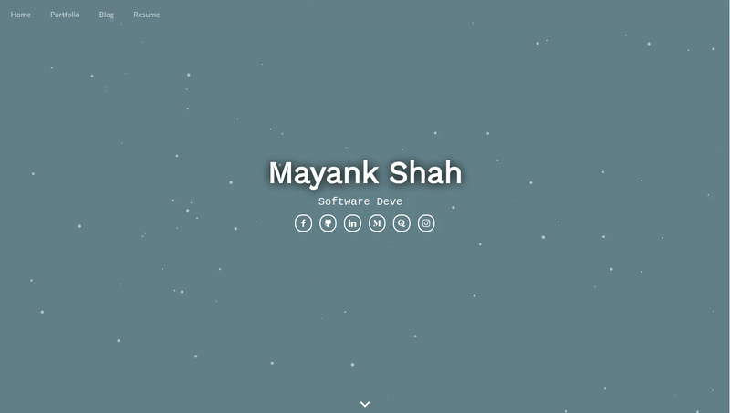

# My Website
[](https://github.com/mayankshah1607/website/master/LICENSE) [](http://makeapullrequest.com) 

This repository contains the code to my personal website made using ReactJS. Check it out [here](www.mayankshah.in)

## Demo


## Getting started
1)  ```
    $ git clone https://github.com/mayankshah1607/personal_website.git
    ```
2)  ```
    cd website
    ```
3)  ```
    npm install
    ```
4) ```
    npm start
    ```
5) Open your favourite text editor, and begin developing by editing contents inside `/src`!

> To add more projects, simply edit `src/Pages/Portfolio/projects.js`
> To add more blogs, simple edit `src/Pages/Blog/bloglist.js`

## License
[MIT](LICENSE.md)
